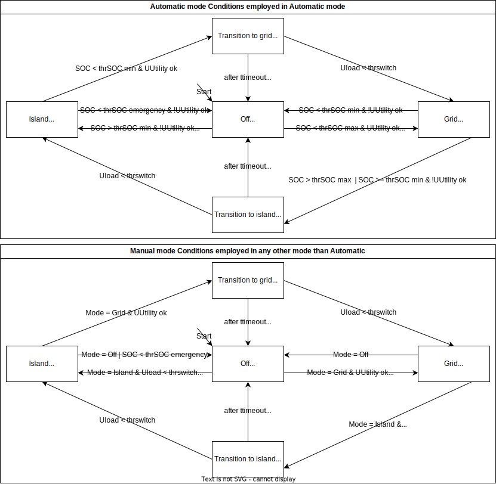

# Automatic Change Over Switch ACOS

This repository contains the software for a device which switches a load between island and utility supply in a manner which protects devices and batteries of the island grid. Automatic and manual mode are possible.

It is designed to run on an [M5StackS3 SE](https://docs.m5stack.com/en/core/M5CoreS3%20SE) which is mounted on a specially designed board.

## Functional description

The device is supposed to fulfill the following functions (in order of their priority):

- [ ] Switching between island and grid mode according to the [state diagram](#state-diagram)
- [ ] enable switching of the current mode via UI on the display
- [ ] show current status and measurements on the display
- [ ] Over the air update
- [ ] Read state of charge via other means than simple contact inputs (RS485, IP, voltage measurement of batteries, island grid frequency, ...)
- [ ] Disable loads selectively via external contact at low state of charge
- [ ] Count and log S0 signals for energy measurements
- [ ] report status and measurement to some logging facility
- [ ] Parameters (thresholds etc.) are configurable

### State diagram

## Development environment

- Arduino Software / compiler: https://www.arduino.cc/en/software
The used version for this project is currently: IDE 2.3.3
- It is mandatory to download the common libraries for the M5
https://github.com/m5stack/M5Unified.git
https://github.com/m5stack/M5GFX.git

## Contributing

We are happy to receive contributions! Please interact with us through the discussion page, pull requests or bug reports. 

## License

This software is licensed under GPLv3. See the attached [license](./COPYING.md) for the full terms. Among other things, you may freely use, change and redistribute this software, but have to license and publish your changes under the same license.